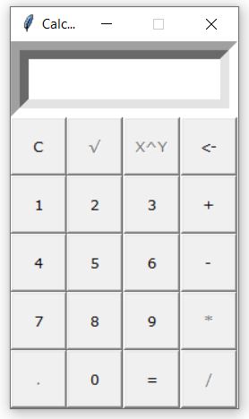

# Python Calculator 

Calculator example with python tkinter


## Getting Started 
Check the sample steps to run it on your computer.

### Installing

1. Clone this repository.
2. Allow execution of the `main.py` file: `$ chmod a+x ./main.py`
3. 3. Execute `main.py`: 

    ```
    $ ./main.py
    ```

    or

    ```
    $ python main.py
    ```
   
## Screen Shoot


## Supported Operations
| operator |    function    |
|----------|----------------|
| +        | addition       |
| -        | subtraction    |
| *        | multiplication |
| /        | division       |
| ^        | square       |
| √        | square root       |
